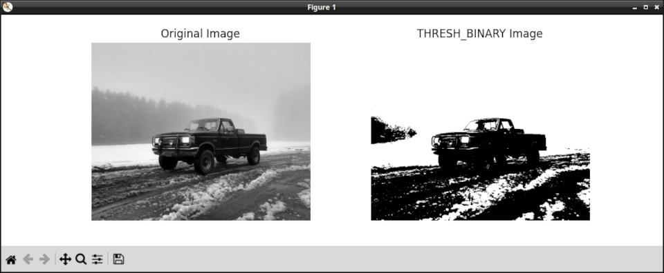

# OpenCV Simple Thresholding Demo

A demo of how to use simple thresholding with OpenCV. 



This is code from my article, [Simple Thresholding with OpenCV and Python: A Beginner's Guide](https://www.jeremymorgan.com/tutorials/opencv/simple-thresholding/)


Also featured on the [Computer Vision Power Hour](https://www.twitch.tv/jeremymorgan/schedule?vodID=1773385086)

## Running these files

Have Python installed on your machine.

Create a new Python environment.

run:

```
pip install -r requirements.txt
```

Enjoy!